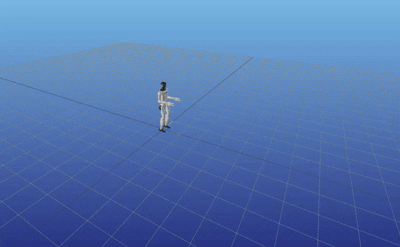

# Aligator_Unitree_G1
Modeling the walking behavior of the Unitree G1 robot using the Aligator trajectory optimization library.

#### Dependencies

* [meshcat](https://github.com/meshcat-dev/meshcat-python) >= 0.0.8
* [Pinocchio](https://github.com/stack-of-tasks/pinocchio)>=3.3.1 

* [robot_descriptions](https://github.com/robot-descriptions/robot_descriptions.py)  >=1.14.0 

* [aligator](https://github.com/Simple-Robotics/aligator)

## Task 
This repository  uses  Aligator trajectory optimization library to desgin following sequence movement for Unitree G1 robot: 4 steps, squat, 2 steps, stance.

 